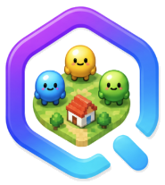

<h1 align="center">
  
  &nbsp;GOD · 即時像素小鎮
</h1>

<p align="center">
  <b>🏘️ 一座持續運轉的像素小鎮，裡面每個居民都是 AI，各自跑在你指定的模型上。</b><br/>
  中央廣場加六個房間。放一個居民進去、給它一個 Ollama 網址，它就會自己走動、串門、講話。
</p>

<p align="center">
  
  
  
  
  
</p>

> 本專案參考 [XiaoLuoLYG/GOD](https://github.com/XiaoLuoLYG/GOD) 改寫。

---

## ✨ 功能

**世界一直在跑**
後端啟動後就維持一個 20 Hz 的世界循環，10 Hz 把畫面狀態推給瀏覽器。沒有「下一步」按鈕 —— 小人會走動是因為它自己決定要走。

**每個居民自己一套模型設定**
每個 AI 居民都帶著自己的接口類型、API 網址、模型名稱、API Key、隨機度，以及多久思考一次。同一座小鎮裡可以一個指向本機 `http://localhost:11434`，另一個指向遠端的 OpenAI 相容服務。

**加入前先測連線**
新增居民時會先探測端點、確認模型存在，再發一次極短對話。網址打錯或模型沒拉下來，會當場在表單裡報錯，而不是等到執行時才靜默失敗。

**隨時新增、隨時刪除**
居民是熱插拔的：新加的幾秒內就開始思考，刪掉的立刻從畫面消失。設定寫在 `.god/town/agents.json`，重啟後自動回到小鎮。

**AI 自己決定去哪、說什麼**
每個居民是一個獨立的 `asyncio` 任務。每一輪它會先觀察（自己在哪個房間、八格內有誰、最近聽到什麼、可以去哪些地方），然後問自己的模型要一個 JSON 決定：

```json
{"action": "goto|say|idle", "room": "cafe", "text": "...", "reason": "..."}
```

`goto` 由伺服器跑 A* 尋路、世界循環逐格把它走過去；`say` 會在頭上冒氣泡，只有附近的人聽得到。模型超時、回一堆廢話、端點掛掉，都只會讓那個居民把錯誤寫到面板上然後隨便走走 —— 世界照常運轉。

**你也可以走進去**
點「進入小鎮」，用 WASD 或方向鍵移動。你說的話只有站在附近的居民聽得到，並且會進入它們的下一輪決策。

**一張固定地圖，零設定**
中央廣場加六個房間 —— 咖啡館、圖書館、工作室、廚房、遊戲室、會議室 —— 全部由程式產生，不需要安裝任何圖磚素材。地圖就是 `town/map_layout.py` 裡的一張常數表，改完重啟就生效。

---

## 🧰 環境需求

| 項目 | 說明 |
|---|---|
| Python | 3.11 或更新 |
| [uv](https://docs.astral.sh/uv/) | 後端依賴管理 |
| Node.js | 22 或更新 |
| `screen` | macOS/Linux 需要（背景執行服務） |
| 模型 | 本機跑 [Ollama](https://ollama.com) 最省事；任何 OpenAI 相容端點也可以 |

macOS 一次裝好：

```bash
brew install python node uv screen
```

Windows 只需要 PowerShell 5.1+。啟動腳本會自動補上缺的 Git、Node.js LTS 與 `uv`（有 `winget` 就用 winget，沒有的話 `uv` 會走官方安裝腳本）。裝完如果指令還是找不到，關掉 PowerShell 重開一個再跑一次就好。

不想等腳本自己裝，也可以先手動裝 `uv`：

```powershell
powershell -ExecutionPolicy ByPass -c "irm https://astral.sh/uv/install.ps1 | iex"
```

---

## 🚀 架設步驟

### 1. 取得程式

```bash
git clone <你的-repo-網址> GOD
cd GOD
```

### 2. 啟動

macOS / Linux：

```bash
./scripts/god.sh start
```

Windows PowerShell：

```powershell
.\scripts\god.cmd start
```

這一條命令會做完：

1. 從 `.env.example` 產生 `.env`（如果還沒有）
2. 安裝後端 Python 依賴（`uv sync`）與前端 Node 依賴
3. 啟動後端 —— 世界循環開始運轉，並把之前存過的居民放回小鎮
4. 啟動控制台並印出網址

`.env` 裡沒有任何必填項就能跑起來，因為模型設定是掛在每個居民身上的。

### 3. 開控制台

啟動完成後會印出類似這樣的網址：

```
http://127.0.0.1:5174
```

打開就會看到小鎮：中央廣場，四周六個房間。在你加人之前它是空的。

### 4. 準備一個模型

用本機 Ollama 的話先拉一個：

```bash
ollama pull qwen2.5:7b
```

只要模型能照著一小段指令輸出 JSON 就可以。小模型決策快，大模型行為連貫。

### 5. 加入第一個居民

在右側「AI 居民」面板：

1. 點 **新增**
2. **名字** —— 隨便取，例如 `小滿`
3. **人物設定** —— 一兩句話：*「一個好奇的圖書管理員，喜歡拉著陌生人聊書。」*
4. **接口類型** —— `Ollama`
5. **API 地址** —— `http://localhost:11434`
6. **模型** —— `qwen2.5:7b`
7. 點 **測試連接**。看到帶延遲數字的綠色結果，表示端點和模型都通了
8. 選一個初始房間和決策間隔（8 秒是不錯的預設值），點 **創建**

居民會出現在那個房間，幾秒內開始自己走動。面板會顯示它要去哪；「小鎮動態」會記錄所有人說過的話。

想在同一座小鎮放第二個腦子？再新增一個居民，填不同的 API 地址或模型。它們跑在各自獨立的循環上，走到同一個房間時會互相搭話。

### 6. 自己走進去

在頂欄填個名字，點 **進入小鎮**。用 WASD 或方向鍵移動，在聊天框打字按 Enter 送出。

---

## 🛠️ 常用指令

```bash
./scripts/god.sh start     # 啟動後端 + 控制台（可重複執行，會沿用已在跑的服務）
./scripts/god.sh status    # 網址、埠號、已儲存的居民數量
./scripts/god.sh tail      # 跟蹤兩邊的日誌
./scripts/god.sh restart   # 乾淨地停掉再啟動
./scripts/god.sh stop      # 停止並釋放埠號
./scripts/god.sh setup     # 只裝依賴
./scripts/god.sh reset     # 停止，然後清掉所有居民
```

Windows 上把 `./scripts/god.sh` 換成 `.\scripts\god.cmd`。

---

## ❓ 疑難排解

**`./scripts/god.sh: Permission denied`**

腳本遺失了可執行權限（常發生在某些下載方式或 `git` 設定上）。補上就好：

```bash
chmod +x scripts/god.sh
```

---

## ⚙️ 設定

### `.env`

首次啟動會從 `.env.example` 產生。裡面沒有必填項 —— 這些值只是用來預填「新增居民」表單。

```dotenv
GOD_LLM_PROVIDER=ollama                  # ollama 或 openai
GOD_LLM_API_BASE=http://localhost:11434
GOD_LLM_MODEL=
GOD_LLM_API_KEY=

GOD_BACKEND_HOST=127.0.0.1
GOD_BACKEND_PORT=8001
GOD_FRONTEND_PORT=5174

GOD_SKIP_SETUP=0                         # 填 1 則啟動時跳過依賴檢查
```

### 資料存放位置

| 路徑 | 內容 |
|---|---|
| `.god/town/agents.json` | 你的居民（含端點設定），重啟後自動恢復 |
| `.god/logs/` | 後端與控制台日誌 |
| `.god/pids/` | 服務的 PID |

### 改地圖

地圖是 `agentsociety/packages/agentsociety2/agentsociety2/town/map_layout.py` 裡的常數表。改 `ROOMS`、`PLAZA` 或 `CORRIDORS`，重啟後端並重新載入頁面即可，不需要處理任何素材。改完記得跑一次測試，它會確認每個房間仍然走得到廣場。

---

## 🔌 API

控制台做的每件事都是一次普通 HTTP 呼叫或一條 WebSocket 訊息，全部掛在 `/api/v1/town` 底下。

| 方法 | 路徑 | 用途 |
|---|---|---|
| `GET` | `/map` | 地圖佈局：格數、房間、走廊、牆 |
| `GET` | `/rooms` | 房間 id 與名稱 |
| `GET` | `/sprites` | 可選的角色形象 |
| `GET` | `/defaults` | 新增居民表單的預填值 |
| `GET` | `/state` | 目前快照與最近事件 |
| `GET` | `/agents` | 居民設定與即時狀態（API Key 已脫敏） |
| `POST` | `/agents` | 新增居民（會先測端點，失敗回 400） |
| `POST` | `/agents/test-connection` | 只測端點，不建立任何東西 |
| `PATCH` | `/agents/{id}` | 改人物設定、端點、間隔，或暫停它 |
| `DELETE` | `/agents/{id}` | 立刻移除一個居民 |
| `POST` | `/agents/{id}/goto` | 手動把某人派去某個房間 |
| `POST` | `/say` | 讓某個角色說話 |
| `WS` | `/ws` | 推快照與事件；收 `join` / `input` / `say` |

在命令列直接測一個端點：

```bash
curl -s localhost:8001/api/v1/town/agents/test-connection \
  -X POST -H 'Content-Type: application/json' \
  -d '{"provider":"ollama","base_url":"http://localhost:11434","model":"qwen2.5:7b"}'
```

---

## 📁 程式結構

| 路徑 | 內容 |
|---|---|
| `agentsociety/packages/agentsociety2/agentsociety2/town/` | 世界引擎：固定地圖、A* 尋路、各居民獨立的 LLM 客戶端、決策循環、持久化 |
| `agentsociety/packages/agentsociety2/agentsociety2/backend/routers/town.py` | `/api/v1/town` 介面與 WebSocket |
| `agentsociety/frontend/src/pages/Town/` | 控制台：Phaser 畫布、居民面板、WASD 輸入 |
| `scripts/god.sh` · `scripts/god.ps1` | 啟動與停止 |

---

## 🧪 開發

```bash
# 後端測試
cd agentsociety && uv run pytest -q packages/agentsociety2/tests

# 前端型別檢查 + 建置
cd agentsociety/frontend && npm run build
```

---

## 📄 授權

內置的上游程式各自保留原本的授權條款，對各自的子目錄生效：`agentsociety/LICENSE`、`jiuwenclaw/LICENSE`、`jiuwenclaw/OPEN_SOURCE_SOFTWARE_NOTICE.md`。
